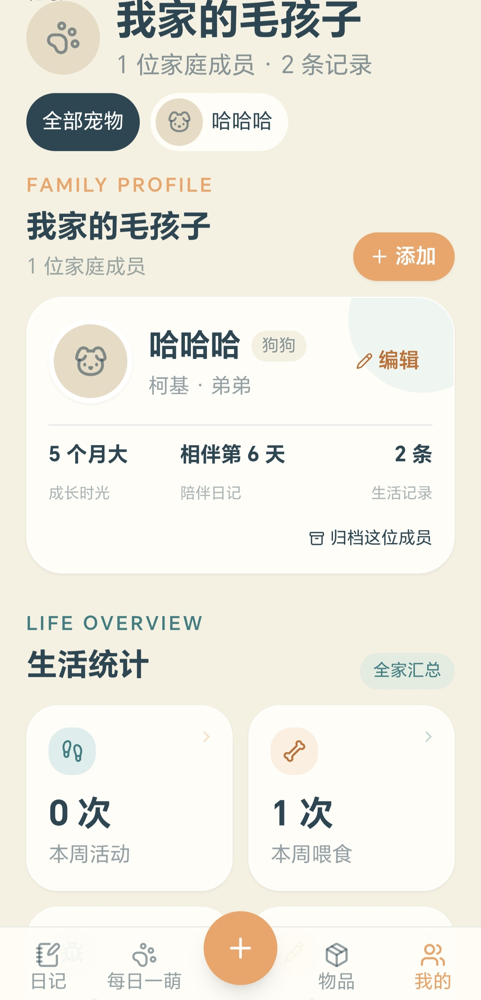
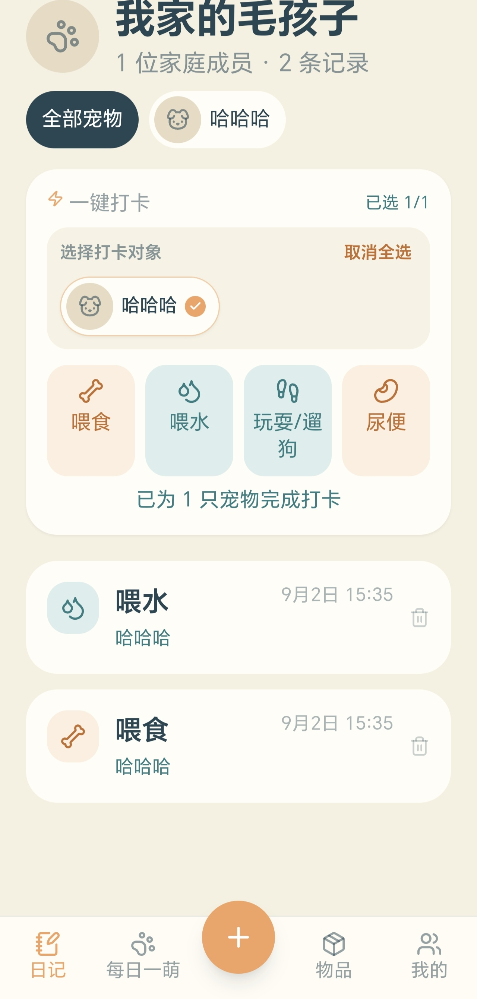
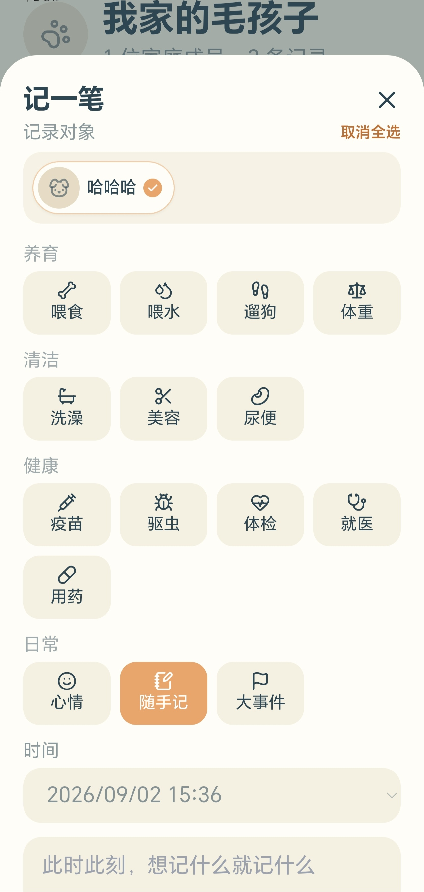
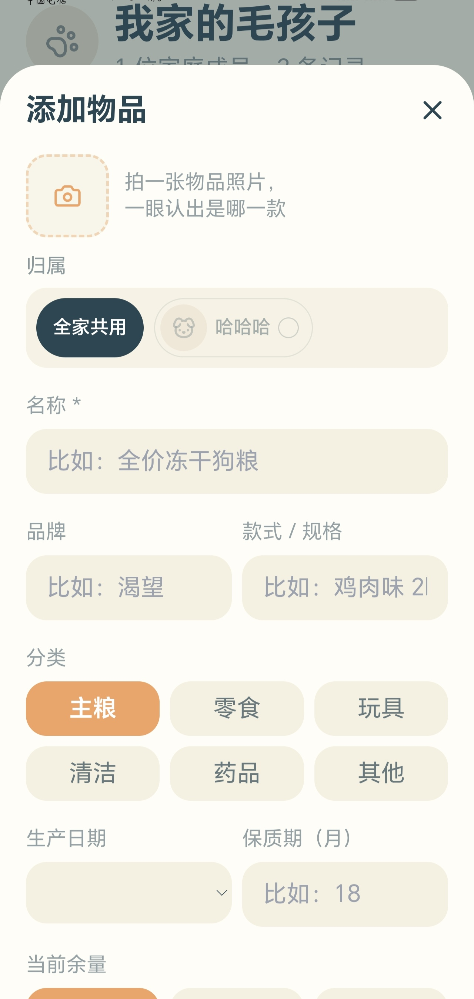

# 宠物小助手

面向个人使用的猫狗生活记录应用。`main` 是本地数据版：Android 使用应用内 SQLite，电脑开发环境使用仅监听本机的 Hono + SQLite 后端；不需要账号、远程服务器、数据库服务或 API 密钥。

当前版本：**1.1.2**

## 界面预览

<p align="center">
  
  
  
  
</p>

<p align="center"><sub>宠物管理与统计 · 多宠物一键打卡 · 详细记录 · 物品管理</sub></p>

截图中的家庭名、宠物名和记录均为界面演示数据，应用不会预置或上传这些内容。

## 主要功能

- 同时管理多只猫咪和狗狗，支持全部宠物聚合视图和单宠物筛选。
- 可同时为一只或多只宠物一键记录喂食、喂水、玩耍/遛狗和尿便；详细记录可补充时间、数值、备注与照片。
- 同一条记录可以关联多只宠物，时间线会合并显示参与成员。
- 每只宠物每天可保存一张“每日一萌”，支持相册选择和直接拍照。
- 记录体重、玩耍/遛弯时长、驱虫、疫苗、体检、大事件等健康与成长数据，并按宠物独立展示体重趋势。
- 猫咪和狗狗分别保存主页健康卡片的显示项目与拖动顺序。
- 物品可以设为全家共用或指定多只宠物；主粮、零食、清洁和药品支持库存状态，玩具与其他类别不显示余量。
- 可编辑家庭名称、家庭头像和宠物档案；头像选图后可拖动、缩放并调整圆形显示范围。
- 宠物支持归档、恢复和二次确认后的永久删除。
- 支持手动检查 GitHub Release 更新，也可开启每天至多一次的自动检查；发现新版本后由系统浏览器前往 GitHub 下载。
- 手机返回键会优先逐层收起正在显示的记录、照片、物品、档案等二级菜单，回到一级主页后才交由系统退出应用。

## 本地数据与备份

“我的 → 设置 → 本地数据保险箱”提供完整导入和导出：

- 备份文件名为 `pet-observation-backup-YYYYMMDD.json`。
- 备份包含活动及归档宠物、家庭信息、生活记录、每日照片、物品、主页卡片设置、宠物头像和家庭头像。
- 导入前会校验数据引用、重复 ID、每日照片唯一性和图片格式；校验失败不会修改现有数据库。
- 导入通过校验并确认后，会整体替换当前业务数据。
- 兼容版本 1 旧备份；旧档案会恢复为第一只狗，旧记录和照片自动关联，旧物品恢复为全家共用。

网页开发模式的数据位置：

- SQLite：`data/pet-life.db`
- 图片附件：`data/uploads/`

Android 数据保存在应用私有目录。`data/`、构建产物和签名资料均已被 Git 忽略。备份文件可能包含私人照片，请自行妥善保管。

## 更新与网络说明

“我的 → 设置 → 应用更新”可手动检查新版本，也可关闭默认开启的每日自动检查。自动检查使用设备本地保存的上次检查时间，24 小时内不会重复请求。

- 更新检查仅请求 GitHub 的公开接口 `api.github.com/repos/husterhyx/pet-observation-assistant/releases/latest`。
- 请求不包含宠物档案、生活记录、照片、备份内容、设备密钥或账号信息。
- 发现新版本后，只会引导至本仓库的 GitHub Release 页面；应用不会静默下载或自行安装 APK。
- 无网络时不影响记录、照片、物品和备份功能，可稍后手动重试。

## 本地开发

要求 Node.js 24。

```powershell
npm ci
Copy-Item .env.example .env
npm run dev
```

打开 <http://127.0.0.1:3000/>。后端启动时会自动执行 `db/migrations/` 中尚未应用的迁移。

常用验证命令：

```powershell
npm run check
npm run lint
npm test
npm run build
npm start
```

## Android 构建

Android 工具链默认使用以下本地环境：

- SDK：`D:\Android\Sdk`
- NDK：`D:\Android\Sdk\ndk\29.0.13846066`
- AVD：`D:\Android\Avd`
- Gradle 缓存：`D:\Android\Build\pet-observation\gradle-cache`
- 英文构建目录：`D:\Android\Build\pet-observation`
- JDK：Microsoft OpenJDK 17

```powershell
npm run android:doctor
npm run android:init
npm run android:build:debug
npm run android:build:emulator
npm run android:build:release
```

版本 1.1.2 的默认输出：

- 真机调试包：`dist/android/pet-observation-1.1.2-arm64-debug.apk`
- 模拟器调试包：`dist/android/pet-observation-1.1.2-x86_64-debug.apk`
- 正式签名包：`dist/android/pet-observation-1.1.2-arm64-release.apk`

构建脚本会清理 Gradle 增量产物，使用英文路径副本规避 Windows 中文路径问题，并剥离交付 APK 中 Rust 动态库的调试符号。脚本只设置当前进程的 Android 与代理环境变量，不修改 Windows 系统配置。

首次正式构建会在当前 Windows 用户的 `.android` 目录生成本项目独立签名密钥和 DPAPI 加密的密码文件。它们不会进入 Git；后续更新必须继续使用同一密钥。跨设备灾备时，需要在当前账户可用时导出密码，并与 JKS 密钥分开保管。

Android 正式包名为 `app.petobservation.local`。应用只在手动检查更新或已开启每日自动检查时访问 GitHub 的公开 Release API，不上传宠物数据、照片或设备信息；自动检查开关和上次检查时间仅保存在本机。从旧包名版本迁移时，请先在旧应用中导出 JSON 备份，再在新应用中导入。

## 发布 GitHub Release

更新检测读取本仓库最新的正式 GitHub Release。发布新版本时：

1. 确认 `package.json`、`src-tauri/Cargo.toml` 与 `src-tauri/tauri.conf.json` 使用相同的三段式版本号。
2. 完成正式 APK 构建并保留脚本输出的 SHA-256。
3. 创建与版本对应的标签，例如 `v1.1.2`；Release 不能设为草稿或预发行版本。
4. 上传 `dist/android/pet-observation-<版本>-arm64-release.apk`，并在发布说明中写明安装方式、主要变化、数据兼容性和 SHA-256。

正式发布后，已安装应用会在下一次手动检查或每日自动检查时发现它。APK 使用 `app.petobservation.local` 包名和同一发布密钥签名时，可以覆盖安装并保留应用私有目录中的本地数据；重要升级前仍建议先导出备份。

## 分支说明

- `main`：纯本地版，当前持续开发与发布的 Android 应用。
- `server`：保留远程同步服务端和服务器部署方案，与本地版隔离维护。
